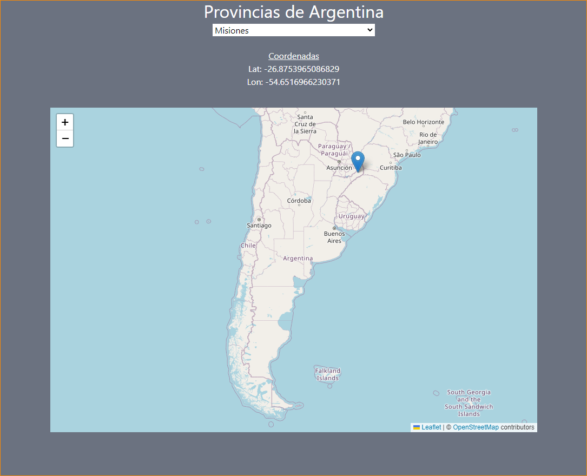

# React + Vite

https://leaflet-map-provinces.vercel.app/

This is a challenge make of my, you can select any province of Argentina, and this app return the coordinates and the ubication on the map

#DEPENDENCIES
"react-leaflet": "^4.2.1"

Currently, two official plugins are available:

- [@vitejs/plugin-react](https://github.com/vitejs/vite-plugin-react/blob/main/packages/plugin-react/README.md) uses [Babel](https://babeljs.io/) for Fast Refresh
- [@vitejs/plugin-react-swc](https://github.com/vitejs/vite-plugin-react-swc) uses [SWC](https://swc.rs/) for Fast Refresh
